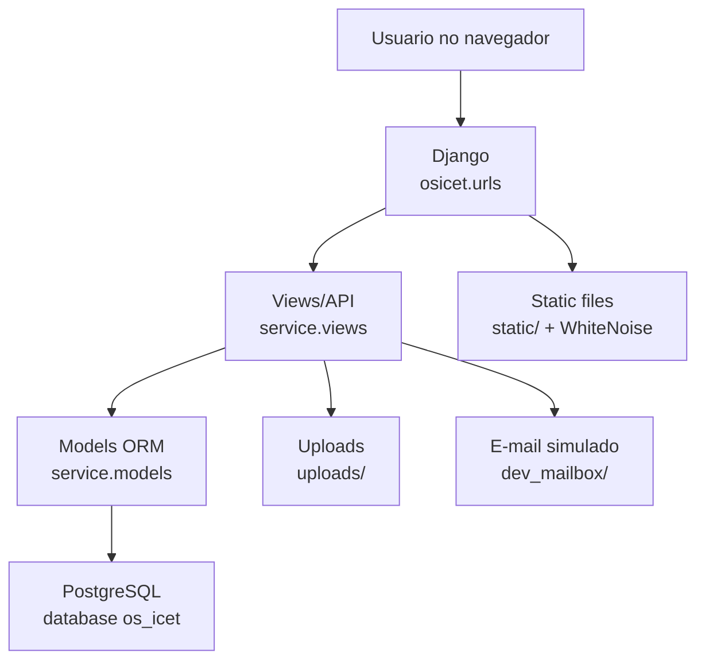
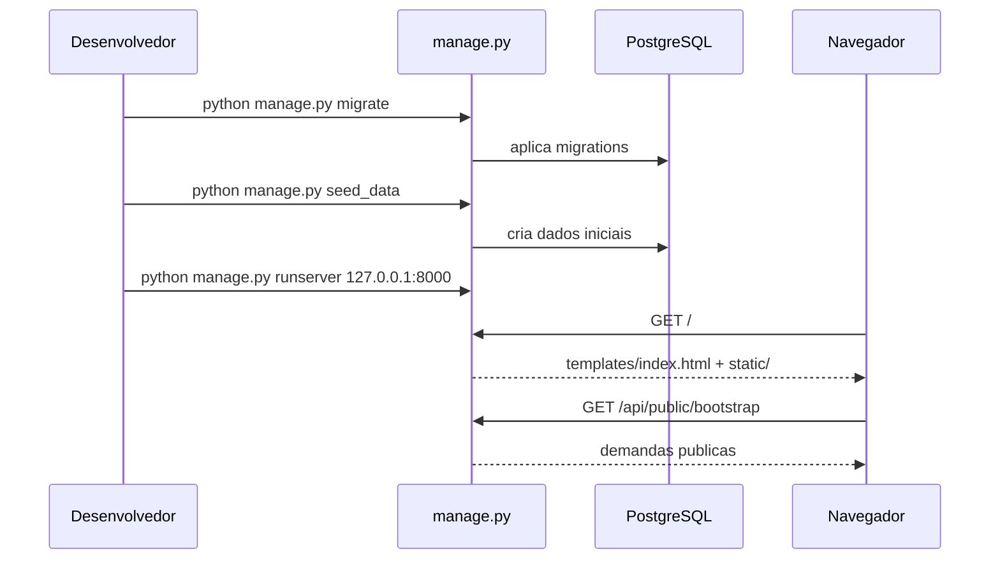
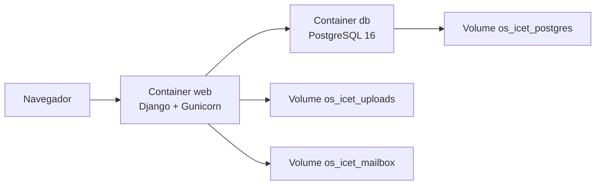

# Arquitetura da Aplicacao

## Visao em camadas

## Organizacao de diretorios

| Caminho | Camada | Responsabilidade |
| --- | --- | --- |
| `osicet/` | Projeto Django | Settings, URLs, ASGI e WSGI |
| `service/` | App Django | Models, views, regras de negocio, migrations e comandos |
| `service/models.py` | Dados | Definicao ORM das tabelas PostgreSQL |
| `service/views.py` | API | Endpoints JSON, autenticacao, permissoes, uploads e e-mails simulados |
| `service/migrations/` | Banco | Migracoes versionadas |
| `service/management/commands/` | Operacao | Seeds iniciais e dados de demonstracao |
| `templates/` | HTML | Template raiz que carrega o frontend |
| `static/` | Frontend | CSS, JavaScript compilado, logo e bibliotecas locais |
| `uploads/` | Dados gerados | Arquivos anexados nas interacoes |
| `dev_mailbox/` | Dados gerados | E-mails simulados para testes locais |
| `doc/` | Documentacao | Guias funcionais e tecnicos |

## Django

O projeto Django e iniciado por `manage.py` e configurado em `osicet/settings.py`.

Pontos principais:

- `INSTALLED_APPS` inclui `django.contrib.contenttypes`, `django.contrib.staticfiles` e `service`.
- O banco usa `django.db.backends.postgresql`.
- Configuracao por `.env` local ou variaveis de ambiente.
- Arquivos estaticos sao servidos por WhiteNoise.
- Uploads ficam em `MEDIA_ROOT = BASE_DIR / "uploads"`.
- E-mails simulados ficam em `DEV_MAILBOX_DIR = BASE_DIR / "dev_mailbox"`.

## Frontend

O frontend React preservado fica em `static/app.compiled.js`, `static/styles.css`, `static/vendor/` e `static/assets/`.

O Django entrega a SPA por:

- `GET /`
- `GET /index.html`

O arquivo `templates/index.html` carrega as bibliotecas locais e o bundle estatico.

## API

As rotas estao em `osicet/urls.py` e chamam funcoes em `service/views.py`.

As views usam:

- `JsonResponse` com `ensure_ascii=False`.
- Decorators `csrf_exempt` e `require_http_methods`.
- Token Bearer persistido em `SessionToken`.
- Permissoes por funcoes auxiliares como `is_admin`, `can_access_request` e `is_resolved_status`.

## Banco

O acesso ao PostgreSQL e feito pelo ORM do Django. As tabelas usam nomes compativeis com o prototipo original:

- `groups`
- `users`
- `demands`
- `requests`
- `interactions`
- `attachments`
- `password_resets`
- `session_tokens`

## Sequencia de inicializacao local

## Docker

