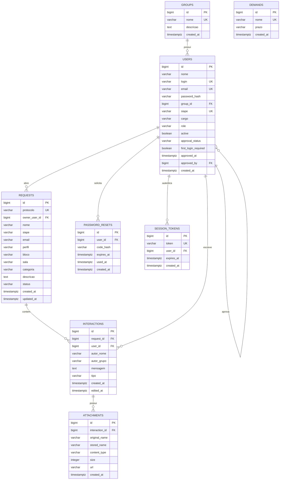

# Modelo de Dados

O banco principal e PostgreSQL. Em desenvolvimento local, a base padrao e:

```text
database: os_icet
host: 127.0.0.1
port: 5432
user: postgres
password: 123qwe
```

No Docker Compose, o PostgreSQL roda no servico `db` e expoe a porta interna `5432`. Para evitar conflito com PostgreSQL local, o compose mapeia a porta do host como `5433:5432`.

## Diagrama entidade-relacionamento



## Tabelas

### `groups`

Armazena grupos de acesso.

| Campo | Tipo Django | Observacao |
| --- | --- | --- |
| `id` | `BigAutoField` | Chave primaria |
| `nome` | `CharField` | Unico |
| `descricao` | `TextField` | Opcional |
| `active` | `BooleanField` | Permite desativar sem excluir |
| `created_at` | `DateTimeField` | Criado com `timezone.now` |

### `users`

Usuarios autenticaveis do sistema.

| Campo | Tipo Django | Observacao |
| --- | --- | --- |
| `id` | `BigAutoField` | Chave primaria |
| `nome` | `CharField` | Nome completo |
| `login` | `CharField` | Unico |
| `email` | `EmailField` | Unico |
| `password_hash` | `CharField` | Hash gerado por `make_password` |
| `group_id` | `ForeignKey` | FK para `groups` |
| `siape` | `CharField` | Unico, opcional |
| `cargo` | `CharField` | Cargo informado no cadastro |
| `role` | `CharField` | `admin` ou `user` |
| `active` | `BooleanField` | Permite bloquear login |
| `approval_status` | `CharField` | `pending` ou `approved` |
| `first_login_required` | `BooleanField` | Obriga troca de senha provisoria |
| `failed_login_attempts` | `PositiveSmallIntegerField` | Tentativas consecutivas de senha invalida |
| `locked_until` | `DateTimeField` | Fim do bloqueio temporario de login |
| `approved_at` | `DateTimeField` | Data da aprovacao |
| `approved_by` | `ForeignKey` | Usuario administrador aprovador |
| `created_at` | `DateTimeField` | Data de criacao |

### `demands`

Tipos de demandas disponiveis no formulario.

| Campo | Tipo Django | Observacao |
| --- | --- | --- |
| `id` | `BigAutoField` | Chave primaria |
| `nome` | `CharField` | Unico |
| `prazo` | `CharField` | Prazo estimado |
| `active` | `BooleanField` | Controla disponibilidade em novas solicitacoes |
| `created_at` | `DateTimeField` | Data de criacao |

### `locations`

Locais fisicos disponiveis na abertura de solicitacoes.

| Campo | Tipo Django | Observacao |
| --- | --- | --- |
| `id` | `BigAutoField` | Chave primaria |
| `nome` | `CharField` | Unico |
| `active` | `BooleanField` | Controla disponibilidade em novas solicitacoes |
| `created_at` | `DateTimeField` | Data de criacao |

### `blocks`

Blocos vinculados a um local.

| Campo | Tipo Django | Observacao |
| --- | --- | --- |
| `id` | `BigAutoField` | Chave primaria |
| `location_id` | `ForeignKey` | Local ao qual o bloco pertence |
| `nome` | `CharField` | Unico dentro do local |
| `active` | `BooleanField` | Controla disponibilidade em novas solicitacoes |
| `created_at` | `DateTimeField` | Data de criacao |

### `requests`

Solicitacoes de atendimento.

| Campo | Tipo Django | Observacao |
| --- | --- | --- |
| `id` | `BigAutoField` | Chave primaria |
| `protocolo` | `CharField` | Formato `OS-ANO-NNNNN` |
| `owner_user_id` | `ForeignKey` | Usuario dono da solicitacao |
| `assigned_user_id` | `ForeignKey` | Administrador responsavel pelo atendimento |
| `nome` | `CharField` | Nome do solicitante |
| `siape` | `CharField` | SIAPE do solicitante |
| `email` | `EmailField` | E-mail do solicitante |
| `perfil` | `CharField` | Perfil/grupo |
| `local` | `CharField` | Nome historico do local selecionado |
| `bloco` | `CharField` | Localizacao |
| `sala` | `CharField` | Localizacao |
| `categoria` | `CharField` | Tipo de demanda |
| `descricao` | `TextField` | Descricao do problema |
| `status` | `CharField` | Aberto, Em Atendimento ou Resolvido |
| `created_at` | `DateTimeField` | Data de abertura |
| `updated_at` | `DateTimeField` | Ultima atualizacao |

### `interactions`

Historico de conversas dentro da solicitacao.

| Campo | Tipo Django | Observacao |
| --- | --- | --- |
| `id` | `BigAutoField` | Chave primaria |
| `request_id` | `ForeignKey` | FK para `requests` |
| `user_id` | `ForeignKey` | Autor |
| `autor_nome` | `CharField` | Nome gravado no momento |
| `autor_grupo` | `CharField` | Grupo gravado no momento |
| `mensagem` | `TextField` | Conteudo da interacao |
| `tipo` | `CharField` | `sistema` ou `mensagem` |
| `created_at` | `DateTimeField` | Data de criacao |
| `edited_at` | `DateTimeField` | Data de edicao |

### `attachments`

Arquivos anexados a interacoes.

| Campo | Tipo Django | Observacao |
| --- | --- | --- |
| `id` | `BigAutoField` | Chave primaria |
| `interaction_id` | `ForeignKey` | FK para `interactions` |
| `original_name` | `CharField` | Nome original |
| `stored_name` | `CharField` | Nome salvo em disco |
| `content_type` | `CharField` | MIME recebido |
| `size` | `PositiveIntegerField` | Tamanho em bytes |
| `url` | `CharField` | Caminho `/uploads/...` |
| `created_at` | `DateTimeField` | Data de envio |

### `password_resets`

Codigos de recuperacao de senha.

| Campo | Tipo Django | Observacao |
| --- | --- | --- |
| `id` | `BigAutoField` | Chave primaria |
| `user_id` | `ForeignKey` | Usuario |
| `code_hash` | `CharField` | Hash do codigo |
| `expires_at` | `DateTimeField` | Expiracao |
| `used_at` | `DateTimeField` | Uso |
| `created_at` | `DateTimeField` | Criacao |

### `session_tokens`

Tokens de sessao Bearer.

| Campo | Tipo Django | Observacao |
| --- | --- | --- |
| `id` | `BigAutoField` | Chave primaria |
| `token` | `CharField` | Token unico |
| `user_id` | `ForeignKey` | Usuario autenticado |
| `expires_at` | `DateTimeField` | Expira em 8 horas |
| `created_at` | `DateTimeField` | Criacao |

## Migracoes

A migracao `0003_set_master_admin_siape` atribui o SIAPE reservado `0000000` ao usuario master de login `admin` apenas quando ele ainda nao possui SIAPE. O comando `seed_data` usa o mesmo valor nas instalacoes novas.

Aplicar migrations:

```bash
python manage.py migrate
```

Criar novas migrations apos alterar `service/models.py`:

```bash
python manage.py makemigrations
python manage.py migrate
```
