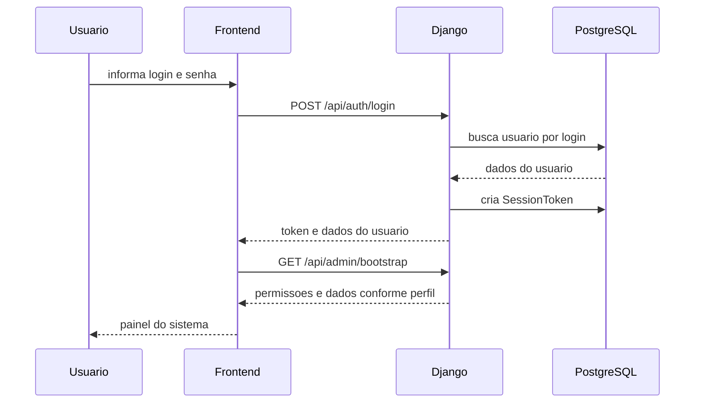
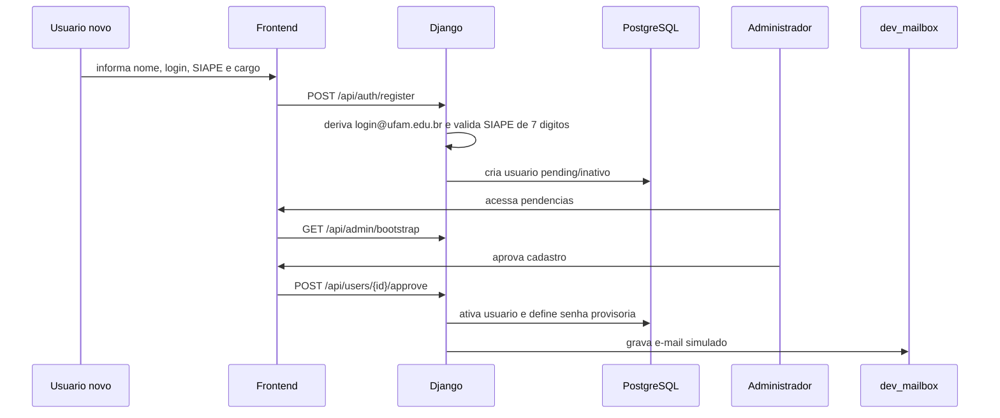
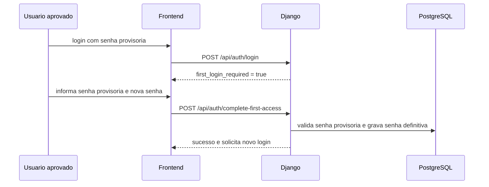
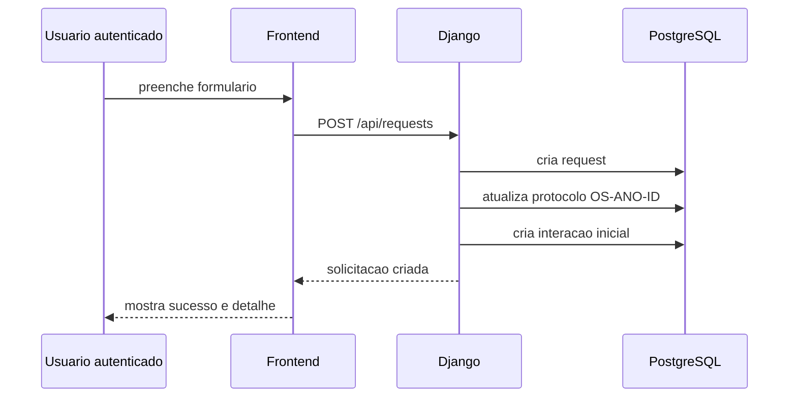
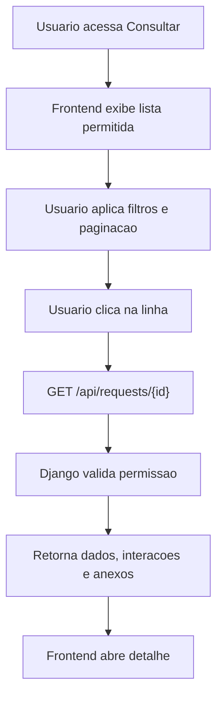
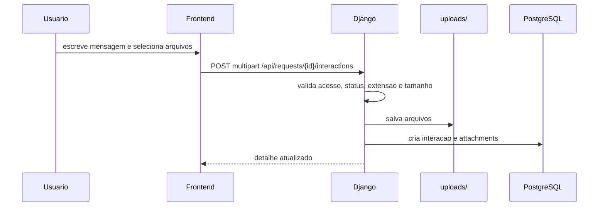
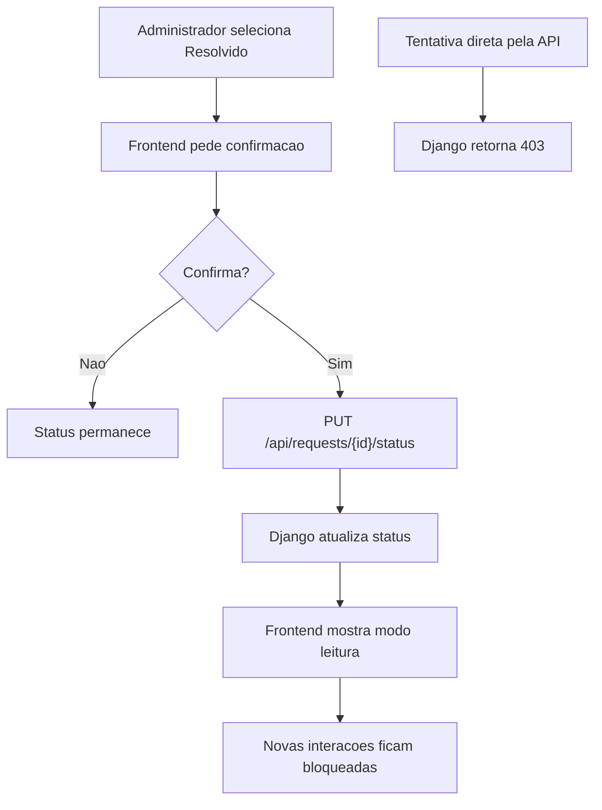
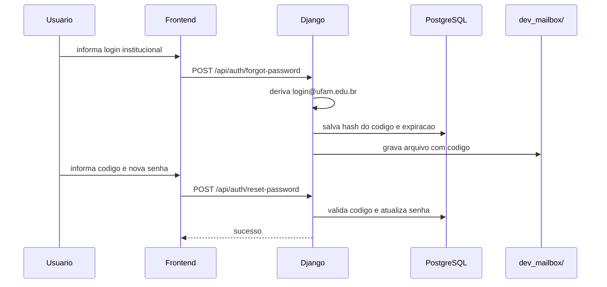

# Fluxos Principais

## Login

## Cadastro publico e aprovacao

## Primeiro acesso

## Cadastro de solicitacao

## Consulta e detalhe

## Interacao com anexos

## Finalizacao como resolvido

## Recuperacao de senha

