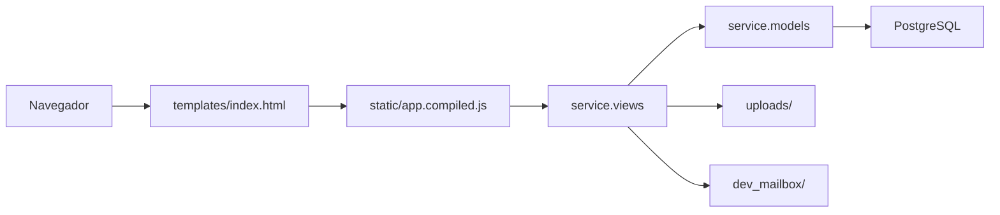

# Manual Tecnico de Manutencao

Este documento orienta programadores na manutencao da versao Django/PostgreSQL do OS ICET/UFAM.

## 1. Arquitetura resumida



## 2. Mapa de arquivos

| Arquivo/Pasta | O que faz | Quando alterar |
| --- | --- | --- |
| `manage.py` | Entrada de comandos Django | Raramente |
| `osicet/settings.py` | Configuracao geral | Banco, static, media, hosts, debug |
| `osicet/urls.py` | Mapeamento de rotas | Novos endpoints |
| `osicet/wsgi.py` | Entrada WSGI | Deploy WSGI |
| `service/models.py` | Modelos ORM | Novas tabelas/campos/relacoes |
| `service/views.py` | API e regras | Funcionalidades, permissoes e validacoes |
| `service/migrations/` | Evolucao do banco | Gerado por `makemigrations` |
| `service/management/commands/seed_data.py` | Seed inicial | Dados padrao |
| `service/management/commands/seed_demo_data.py` | Seed de demonstracao | Massa de apresentacao |
| `service/tests.py` | Testes de regressao | Regras de cadastro, SIAPE, senha provisoria e recuperacao |
| `templates/index.html` | HTML base | Ordem de scripts e assets |
| `static/app.compiled.js` | Frontend React compilado | Alteracoes de interface |
| `static/styles.css` | Estilos | Visual e responsividade |
| `requirements.txt` | Dependencias Python | Bibliotecas |
| `Dockerfile` | Imagem web | Runtime/deploy |
| `docker-compose.yml` | Web + banco | Infra local |
| `doc/` | Documentacao | Sempre que mudar regra/API/operacao |

## 3. Settings importantes

`osicet/settings.py` le `.env` da raiz quando existir.

Configuracoes relevantes:

- `SECRET_KEY`: `DJANGO_SECRET_KEY`.
- `DEBUG`: `DJANGO_DEBUG`.
- `ALLOWED_HOSTS`: `DJANGO_ALLOWED_HOSTS`.
- `DATABASES`: PostgreSQL por `POSTGRES_*`, `DB_HOST` e `DB_PORT`.
- `STATIC_ROOT`: `staticfiles/`.
- `STATICFILES_DIRS`: `static/`.
- `MEDIA_ROOT`: `uploads/`.
- `DEV_MAILBOX_DIR`: `dev_mailbox/`.

## 4. Models

Modelos principais:

- `AccessGroup`
- `User`
- `Demand`
- `ServiceRequest`
- `Interaction`
- `Attachment`
- `PasswordReset`
- `SessionToken`

Cuidados:

- Os nomes de tabela sao definidos por `db_table` para preservar compatibilidade conceitual com o prototipo.
- Nao excluir usuarios fisicamente se houver historico.
- Alteracoes em models exigem migrations.
- Atualize `doc/banco-de-dados.md` apos mudancas estruturais.

## 5. Views e API

`service/views.py` concentra endpoints e regras.

Funcoes utilitarias importantes:

| Funcao | Uso |
| --- | --- |
| `api_response` | Resposta JSON padronizada |
| `read_json` | Le corpo JSON |
| `format_dt` | Formata datas para o frontend |
| `user_dict`, `request_dict`, `interaction_dict` | Serializacao |
| `current_user` | Valida token Bearer |
| `require_user` | Exige autenticacao |
| `is_admin` | Verifica permissao admin |
| `can_access_request` | Restringe acesso a OS |
| `is_resolved_status` | Bloqueia alteracoes em OS resolvida |
| `save_uploaded_files` | Valida e salva anexos |

## 6. Como adicionar endpoint

1. Criar funcao em `service/views.py`.
2. Adicionar `@csrf_exempt` se a rota for consumida pela SPA atual sem CSRF cookie.
3. Adicionar `@require_http_methods`.
4. Validar autenticacao com `require_user`, se necessario.
5. Validar permissao.
6. Retornar `api_response`.
7. Registrar rota em `osicet/urls.py`.
8. Atualizar `doc/api.md`.

## 7. Como adicionar campo

1. Alterar `service/models.py`.
2. Rodar:

```bash
python manage.py makemigrations
python manage.py migrate
```

3. Ajustar serializadores em `service/views.py`.
4. Ajustar criacao/edicao do endpoint.
5. Ajustar frontend se o campo aparecer na interface.
6. Atualizar docs.

## 8. Seeds

### `seed_data`

Cria:

- Grupos iniciais.
- Usuarios `admin`, `docente`, `tecnico`.
- Demandas padrao.
- Solicitacoes iniciais se nao houver nenhuma.

### `seed_demo_data`

Cria massa para apresentacao:

- Usuarios demo.
- Demandas extras.
- Solicitacoes abertas, em atendimento e resolvidas.
- Interacoes variadas.

O comando sincroniza sequencias do PostgreSQL antes de inserir dados, pois `seed_data` usa IDs fixos para registros iniciais.

## 9. Frontend preservado

A SPA React e servida como arquivos estaticos. O arquivo carregado pelo navegador e:

```text
static/app.compiled.js
```

Se houver fonte React editavel em outro repositorio, prefira alterar la e trazer o bundle compilado para este projeto. Se editar diretamente o bundle, documente bem a mudanca.

## 10. Uploads

Uploads sao gravados em `uploads/`.

Extensoes permitidas ficam em:

```python
ALLOWED_UPLOAD_EXTENSIONS
```

Ao mudar formatos aceitos:

1. Atualizar backend.
2. Atualizar frontend se houver atributo `accept`.
3. Atualizar `doc/api.md`, `doc/requisitos.md` e `doc/manual-usuario.md`.

## 11. E-mails simulados

Arquivos gerados:

- `reset_<email>.txt`
- `approved_<email>.txt`

Pasta:

```text
dev_mailbox/
```

Para producao, substituir por SMTP real ou servico institucional.

## 12. Checklist apos alteracoes

Execute:

```bash
python manage.py check
python manage.py migrate
python manage.py test service
```

Validar manualmente:

1. Login admin.
2. Login usuario comum.
3. Cadastro publico.
4. Aprovacao de pendente.
5. Primeiro acesso.
6. Criacao de solicitacao.
7. Consulta e detalhe.
8. Interacao com anexo.
9. Edicao de interacao pelo autor.
10. Bloqueio em solicitacao resolvida.
11. Gerenciamento administrativo.
12. Relatorios.
13. Cadastro administrativo com senha provisoria automatica.
14. Recuperacao informando somente o login institucional.
15. SIAPE com exatamente 7 digitos nos dois cadastros.
16. Edicao de usuario pelo clique na linha.
17. Data/hora e prazo estimado na lista de solicitacoes.

## 13. Como trabalhar no Git

Fluxo recomendado:

```bash
git status --short --branch
git add .
git commit -m "Descricao objetiva"
git push origin main
```

Antes de commitar:

- Nao adicionar `.env`.
- Nao adicionar `.venv/`.
- Nao adicionar `uploads/`.
- Nao adicionar `dev_mailbox/`.
- Nao adicionar `staticfiles/`.
- Nao adicionar `runserver*.log` ou `runserver.exitcode`.
- Conferir `git diff`.
- Atualizar `doc/` quando houver mudanca funcional.

## 14. Onde procurar problemas

| Sintoma | Verificar primeiro |
| --- | --- |
| Pagina nao abre | `runserver`, rota `/`, `templates/index.html` |
| Static nao carrega | `static/`, `STATICFILES_DIRS`, WhiteNoise |
| Login falha | Usuario ativo/aprovado, senha, `SessionToken` |
| Usuario comum ve dados indevidos | `can_access_request` e `admin_payload` |
| Status resolvido ainda edita | `is_resolved_status` nos endpoints |
| Anexo nao salva | `uploads/`, extensao, tamanho, permissao de escrita |
| E-mail nao aparece | `dev_mailbox/` e funcoes `write_*_email` |
| Erro de banco | `.env`, PostgreSQL, migrations |
| Docker nao sobe | `docker compose logs web` e healthcheck do `db` |
